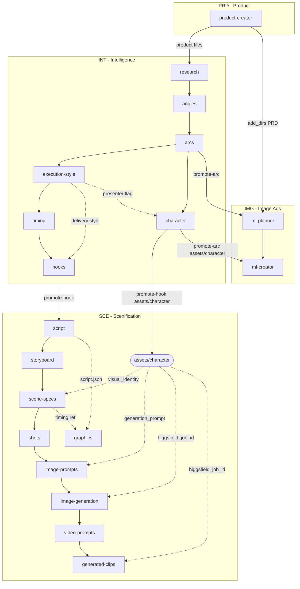

# Ad Video Suite — Workflow Reference

The folder tree IS the pipeline. There is no forced order, no state machine. Agents are isolated — each reads and writes in the `cwd` the user selects. The campaign folder tree forms naturally as agents run.

---

## Naming Convention

| Level | Pattern | Example | Full path context |
|---|---|---|---|
| Campaign | `C###` | `C001` | root |
| Section | `[A-Z]{3}` | `INT`, `SCE`, `PRD`, `IMG` | `C001/INT` |
| Platform | `[A-Z]{2}` | `ML` | `C001/IMG/ML` |
| Angle | `A##` | `A01` | `C001/INT/A01` |
| Arc | `A##R##` | `A01R01` | `C001/INT/A01/A01R01` |
| Hook | `A##R##H##` | `A01R01H01` | `C001/INT/A01/A01R01/A01R01H01` |

Full reference (for Higgsfield logs, exports): `C001-INT-A01R01H01`.

---

## Campaign Folder Tree

```
{base_path}/C001/
  campaign.json
  agents/
    agents-config.yaml       ← per-campaign, generated from template at creation
    prompts/                 ← per-campaign task instructions (one .md per agent)
  product/                   ← user drops product files here (read-only for agents)
  PRD/                       ← Product section
    images/
    product.json
    product_summary.md
    marketing_profile.json
    assets.json
  IMG/
    ML/
      A01R01/                ← arc subfolder (cwd for ml-* agents, seeded by promote-arc)
        research.md
        A01.md
        A01R01.md
        hooks-index.md
        A01R01H01.md
        assets/character/
          character.json
          approved/approved.png
        ad_plan.md
        ad_concepts.json
        ads/
  INT/
    research.md
    A01/
      A01.md
      A01R01/
        A01R01.md
        timing-blueprint.json
        assets/character/
          character.json
          attempts/
          disapproved/
          approved/approved.png
        A01R01H01/
          A01R01H01.md
  SCE/
    A01R01H01/               ← hook root (seeded by promote-hook)
      research.md
      A01.md
      A01R01.md
      timing-blueprint.json
      A01R01H01.md
      assets/character/
        character.json
        approved/approved.png
      script/
        script-blueprint.json    ← script agent writes (lines + estimated timing)
        script-blueprint.ssml    ← script agent writes (TTS input for ElevenLabs)
        script-readthrough.md    ← script agent writes
        script.json              ← backend-generated before storyboard opens
        [anything].srt           ← user drops here after TTS generation (any filename)
      storyboard/
        M01.json
        M02.json
        storyboard.md
        summary.md
      scene-specs/
        S01.json
        S02.json
        summary.md
      shots/
        S01/
          SH001.json
        S02/
          SH002.json
        summary.md
      image-prompts/
        SH001.json
        SH002.json
      image-generation/
        SH001/attempts/ approved/ disapproved/
      video-prompts/
        SH001/attempts/ approved/ disapproved/
        summary.md
      generated-clips/
        SH001/attempts/ approved/ disapproved/
      graphics/
        graphics-plan.json
```

---

## Sections and Agents

| Section | Agent | cwd | Role |
|---|---|---|---|
| `PRD/` | `product-creator` | `PRD/` | Collect and structure product knowledge |
| `INT/` | `research` | `INT/` | Audience intelligence from product folder |
| `INT/` | `angles` | `INT/` | Generate strategic positioning options |
| `INT/A##/` | `arcs` | `INT/A##/` | Narrative concept variants for the chosen angle — beats with physical manifestations |
| `INT/A##R##/` | `execution-style` | `INT/A##R##/` | Production style matrix — framing, presenter rules, micro-expression guidance |
| `INT/A##R##/` | `timing` | `INT/A##R##/` | Phase timing blueprint (35 s, max word counts) |
| `INT/A##R##/` | `hooks` | `INT/A##R##/` | Hook variants for chosen narrative and execution style |
| `INT/A##R##/` | `character` | `INT/A##R##/` | Design + generate approved character reference image |
| `IMG/ML/A##R##/` | `ml-planner` | `IMG/ML/A##R##/` | Plan 5 ML ad concepts |
| `IMG/ML/A##R##/` | `ml-creator` | `IMG/ML/A##R##/` | Generate ML ad images via Higgsfield |
| `SCE/A##R##H##/` | `script` | `SCE/A##R##H##/` | Full 35 s spoken script |
| `SCE/A##R##H##/` | `storyboard` | `SCE/A##R##H##/` | Moment-by-moment visual storyboard |
| `SCE/A##R##H##/` | `scene-specs` | `SCE/A##R##H##/` | Per-scene production spec |
| `SCE/A##R##H##/` | `shots` | `SCE/A##R##H##/` | Shot list with `render_type` and `needs_last_frame` |
| `SCE/A##R##H##/` | `image-prompts` | `SCE/A##R##H##/` | First/last frame prompts per shot |
| `SCE/A##R##H##/` | `image-generation` | `SCE/A##R##H##/` | Keyframe images via Higgsfield |
| `SCE/A##R##H##/` | `video-prompts` | `SCE/A##R##H##/` | Motion instructions per shot |
| `SCE/A##R##H##/` | `generated-clips` | `SCE/A##R##H##/` | Video clips via Higgsfield |
| `SCE/A##R##H##/` | `graphics` | `SCE/A##R##H##/` | Remotion motion graphics plan |

---

## Promotion: INT → SCE and INT → IMG

**`promote-hook`** — user-triggered from the UI. Seeds `SCE/A##R##H##/` with all context files from `INT/`:

- `research.md`, `A##.md`, `A##R##.md`, `A##R##H##.md`, `timing-blueprint.json`
- `assets/character/` (copied from `INT/A##/A##R##/assets/character/`)

**`promote-arc`** — user-triggered. Seeds `IMG/ML/A##R##/` with arc context:

- `research.md`, `A##.md`, `A##R##.md`, `hooks-index.md`, `A##R##H##.md` files
- `assets/character/` (same copy from `INT/A##/A##R##/assets/character/`)

After promotion, the downstream agents have all context they need to run.

---

## Character Sharing

The `character` agent runs in `INT/A##R##/`. It produces a single approved reference image for the arc's main character and writes `assets/character/character.json`:

```json
{
  "name": "...",
  "visual_identity": "...",
  "generation_prompt": "...",
  "higgsfield_job_id": "...",
  "approved_image": "assets/character/approved/approved.png"
}
```

Downstream consuming agents pass `higgsfield_job_id` directly as `--image <job_id>` in CLI
calls — no re-upload needed:

| Agent | How character is used |
|---|---|
| `scene-specs` | Embeds `visual_identity` in `subject` / `visual_description` fields |
| `image-prompts` | Embeds `generation_prompt` in first/last frame prompts |
| `image-generation` | Passes `higgsfield_job_id` as `--image` to `higgsfield generate create` |
| `generated-clips` | Passes `higgsfield_job_id` as `--image` to `higgsfield generate create` |
| `ml-creator` | Passes `higgsfield_job_id` as `--image` for human-model ad concepts |

All character references are optional — agents check for the file and proceed without it if absent.

---

## SCE Vertical Channels — Artifact Structure

Each pipeline level uses per-item files so surgical re-runs are structural:

| Level | Files | Upward reference |
|---|---|---|
| Script | `script/script-blueprint.json` (agent) · `script/script.json` (generated) | — (root) |
| Storyboard | `storyboard/M{##}.json` | — |
| Scene-specs | `scene-specs/S{##}.json` | `storyboard_id` → parent moment |
| Shots | `shots/{scene_id}/SH{###}.json` | `scene_id` → parent scene |
| Image-prompts | `image-prompts/SH{###}.json` | `shot_id` → parent shot |
| Image-generation | `image-generation/{shot_id}/attempts\|approved\|disapproved/` | — |
| Video-prompts | `video-prompts/{shot_id}/attempts\|approved\|disapproved/` | — |
| Generated-clips | `generated-clips/{shot_id}/attempts\|approved\|disapproved/` | — |

### `render_type` routing

Set by scene-specs, inherited by shots, propagated to all downstream agents:

| Value | Pipeline |
|---|---|
| `"video"` | Higgsfield — image-generation → video-prompts → generated-clips |
| `"motion_graphics"` | Remotion/AE — graphics agent; skipped by Higgsfield agents |

### `needs_last_frame`

Boolean set by the shots agent on every shot JSON. Controls whether a last-frame keyframe is generated:

- `false` — terminal shots (`continuity_to: null`) or very short static shots (≤2 s, visually identical start/end)
- `true` — all other shots where exit frame must match the opening of the next shot

Consumed by: image-prompts, image-generation, video-prompts, generated-clips.

### Audio timing reconciliation

The script agent estimates `start_s`/`end_s` per line at 2.5 words/second and writes:
- `script/script-blueprint.json` — creative output with estimated timing
- `script/script-blueprint.ssml` — ready to paste into ElevenLabs or any TTS
- `script/script.json` — exact copy of the blueprint (ensures downstream agents always find the file)

After generating audio externally, drop the downloaded SRT file anywhere in `script/` (any filename, `.srt` extension). When the **storyboard** agent is opened, the backend automatically:

1. Scans `script/` for any `.srt` file
2. Reconciles word-level SRT segments back to blueprint lines via sequential word anchoring
3. Overwrites `script/script.json` with real `start_s`/`end_s` per line (field `"source": "srt"`)
4. Reports per-line timing diff inline in the storyboard conversation before the agent fires

If no SRT is present, `script.json` is left as a clean copy of the blueprint and the storyboard agent is told to use estimated timing. All downstream agents read only `script.json` and are unaware of this step.

The `source` field added per line (`"srt"` | `"blueprint"`) is informational only — it has no effect on how downstream agents consume the file.

### Attempt / Approve / Disapprove pattern

`image-generation`, `video-prompts`, and `generated-clips` all use the same three-subfolder pattern per shot:

```
{shot_id}/
  attempts/    ← in-progress, awaiting review
  approved/    ← user confirmed
  disapproved/ ← user rejected
```

Attempt numbering counts across all three subfolders to avoid collisions on retries.

---

## Agent Execution Map



---

## SCE Agent Input/Output Summary

| Agent | Required inputs | Output |
|---|---|---|
| `script` | `timing-blueprint.json`, `A*H*.md` (promote-hook) | `script/script-blueprint.json`, `script/script.json` (copy), `script/script-blueprint.ssml`, `script/script-readthrough.md` |
| `storyboard` | `script/script.json` (backend-generated from blueprint + optional SRT) | `storyboard/M{##}.json`, `storyboard/storyboard.md`, `storyboard/summary.md` |
| `scene-specs` | `storyboard/M*.json`, `script/script.json` | `scene-specs/S{##}.json`, `scene-specs/summary.md` |
| `shots` | `scene-specs/S*.json` | `shots/{scene_id}/SH{###}.json`, `shots/summary.md` |
| `image-prompts` | `shots/S*/SH*.json`, `scene-specs/S*.json` | `image-prompts/SH{###}.json` |
| `image-generation` | `image-prompts/SH*.json` | `image-generation/{shot_id}/attempts\|approved\|disapproved/attempt-{###}.json` |
| `video-prompts` | `shots/S*/SH*.json`, `image-generation/*/approved/*.json` | `video-prompts/{shot_id}/attempts\|approved\|disapproved/attempt-{###}.json`, `video-prompts/summary.md` |
| `generated-clips` | `video-prompts/*/approved/*.json` | `generated-clips/{shot_id}/attempts\|approved\|disapproved/attempt-{###}.json` |
| `graphics` | `script/script.json`, `scene-specs/scene-specs.json` | `graphics/graphics-plan.json` |

---

## Higgsfield Agents

Four agents call Higgsfield directly via the `higgsfield` CLI (`Bash` tool). No MCP server needed — CLI must be installed and authenticated on the host.

| Agent | CLI command | Reference media |
|---|---|---|
| `character` | `higgsfield generate create <model> --prompt "..." --wait --json` | — (portrait generation) |
| `ml-creator` | `higgsfield generate create <model> --prompt "..." --image <ref> --wait --json` | product upload_id; `higgsfield_job_id` from `character.json` (human-model concepts) |
| `image-generation` | `higgsfield generate create <model> --prompt "..." --image <char_job_id> --wait --json` | `higgsfield_job_id` from `character.json` (optional) |
| `generated-clips` | `higgsfield generate create <model> --prompt "..." --start-image <first> --end-image <last> --wait --json` | `first_frame_job_id`, `last_frame_job_id`, `character_reference_job_id` from approved video-prompt |

### Video model reference

| Model | `end_image` | Durations | Default use |
|---|---|---|---|
| `kling_2_5_turbo` | Yes | 5 s or 10 s | Product demos, lifestyle, image-to-video ads |
| `kling3_0` | Yes | 3–15 s | Higher quality or flexible duration |
| `seedance_2_0` | Yes | 4–15 s | Cinematic SOTA, multi-shot identity consistency |

---

## Workflow Variants

### Mechanism

A **workflow** is defined entirely by two things:
1. **Prompt files** — what each agent does when it runs
2. **Which agents are active** — entries in `agents-config.template.yaml`

The folder tree, naming convention (`A##`, `A##R##`, `A##R##H##`), and all `cwd_pattern`
regexes **never change between workflows**. Switching workflows has zero structural impact
on existing campaign folders — agents that are removed simply won't appear in the UI; their
folders and files are left untouched.

Archived prompt variants live in `agents/prompts/variants/`. To switch a workflow:
1. Copy the target variant file over the active prompt in `agents/prompts/`
2. Add or remove agent entries in `agents-config.template.yaml`
3. Propagate to campaigns (see below)

---

### Active Workflow: Narrative Concept + Execution Style (v2)

**INT pipeline:** `research → angles → arcs (narrative-concept) → execution-style → timing → hooks → character`

The `arcs` agent generates narratives with physical beat descriptions (observable actions +
facial expressions). The `execution-style` agent then imposes production constraints
(framing, presenter rules, micro-expression guidance) before hooks and script run.

| Prompt file | Variant archive |
|---|---|
| `agents/prompts/arcs.md` | `variants/arcs-narrative-concept.md` |
| `agents/prompts/execution-style.md` | `variants/execution-style-v1.md` |

---

### Archived Workflow: Arcs Only (v1)

**INT pipeline:** `research → angles → arcs (emotional-arc) → timing → hooks → character`

The `arcs` agent generates abstract emotional arc variants (phase breakdown, tone, pacing,
key visual mood). No execution style layer. Downstream agents receive less visual grounding
but the flow is simpler and faster to iterate.

| Prompt file | Variant archive |
|---|---|
| `agents/prompts/arcs.md` | `variants/arcs-emotional-arc.md` |
| *(no execution-style agent)* | — |

**To revert to v1:**

```bash
# 1. Restore the original arcs prompt
cp agents/prompts/variants/arcs-emotional-arc.md agents/prompts/arcs.md

# 2. Remove execution-style from the template config
#    Delete the entire `execution-style:` block from agents-config.template.yaml

# 3. Propagate to campaigns
python3.12 -c "
from agents.config import resolve_campaign_config, get_settings
base = get_settings()['base_path']
for slug in ['C001', 'C002', 'C003']:
    content = resolve_campaign_config(slug, base)
    open(f'{base}/{slug}/agents/agents-config.yaml', 'w').write(content)
    print(f'{slug} updated')
"

# 4. Copy the restored arcs.md to existing campaign prompts
for c in C001 C002 C003; do
  cp agents/prompts/arcs.md {base_path}/$c/agents/prompts/arcs.md
done
```

Notes:
- Existing `A##R##/` folders produced under v2 (with narrative-concept content) are not
  affected — they stay on disk. The `arcs` agent will see them on resume and offer to
  rework them, now using the v1 emotional-arc style.
- The `execution-style.md` prompt file can be left in campaign `prompts/` folders — it
  does no harm if the agent is removed from the config (it simply won't be offered).

---

### Adding a New Workflow Variant

1. Write or copy a new prompt file into `agents/prompts/variants/` with a descriptive name
   (e.g. `arcs-problem-solution.md`)
2. Copy it to `agents/prompts/arcs.md` (or the relevant agent's prompt file) to activate it
3. If the variant requires new agents, add them to `agents-config.template.yaml`
4. Propagate to campaigns
5. Archive the previous active version in `variants/` before overwriting

The variants directory is the single source of truth for all prompt history. Name files as
`{agent-id}-{variant-name}.md` so the active agent is always clear from the archive.
